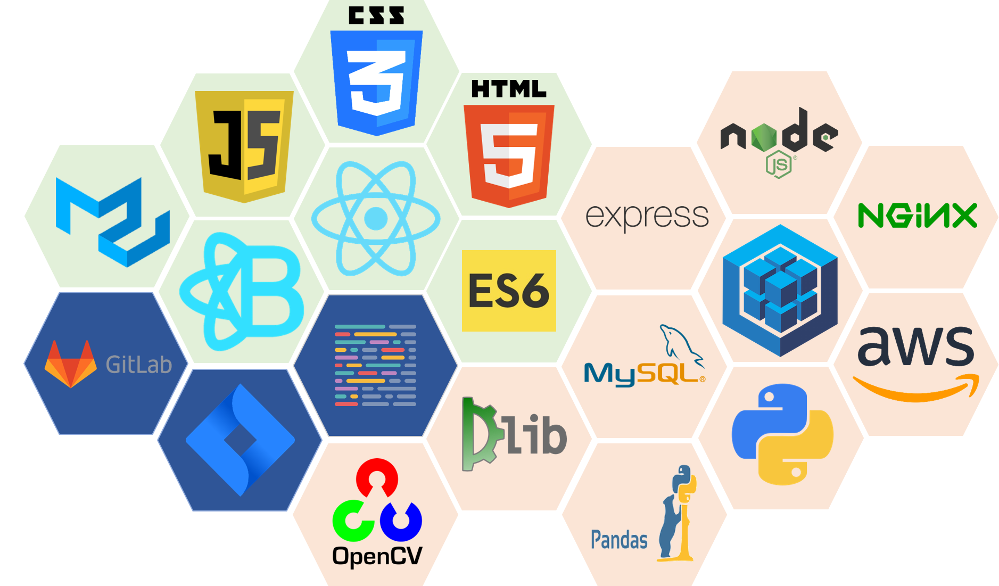
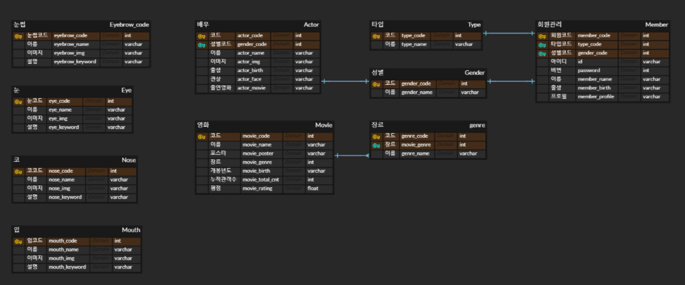
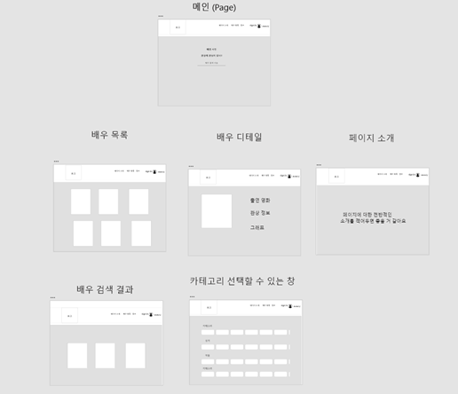
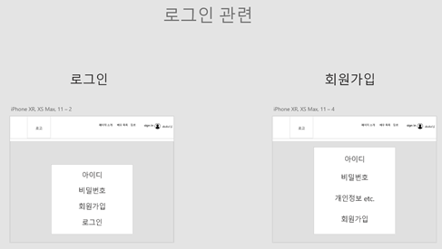

# &#128250; The Casting

[TOC]

## 소개

> 팀 이름: 웃음기 머금고
>
> 프로젝트 명: The Casting
>
> 팀장 : 김재경
>
> 팀원: 구준모, 김경수, 변찬석, 윤종현

## 배포 주소

> https://j3b206.p.ssafy.io/

## 주제

>머신러닝 라이브러리와 빅데이터를 활용하여 영화 이미지에 맞는 배우 추천

## 개요

> 감독이 찾는 이미지의 배우를 관상이라는 지표를 통해 찾을 수 있도록 도와주는 서비스
>
> 신인 배우에게 본인의 이미지와 맞는 배역을 구인구직할 수 있도록 도와주는 서비스

## 주요타켓 및 대상

>배우 선택에 있어 많은 고민을 하는 감독
>
>자신을 어필할 수 있는 장이 부족한 신인 배우

## 페르소나

> ### 감독
>
> 내가 생각하는 이미지의 배우를 찾아보고 싶다.
>
> 내가 생각하는 이미지와 객관적인 이미지가 일치하는지 확인하고 싶다.
>
> 
>
> ### 신인 배우
>
> 구인구직을 하고싶다.
> 나를 알릴 수 있는 곳이 필요하다.

## 기능

> openCV를 이용하여 DB에 저장된 이미지를 분석하여 관상에 따라 분류한다.
> 사용자는 키워드로 검색하여 가장 일치하는 배우를 찾을 수 있다.
> 사용자는 등록하기 페이지를 통해 신인 배우로 등록할 수 있다.

## 유사 서비스

> ### 캐스팅 디비
>
> - 비슷한 부분
>
>   구인구직할 수 있는 서비스는 비슷하나 관상에 대한 데이터를 등록할 수 있는 것이 다르다.
>
> - 차별점
>
>   감독도 배우를 장르, 이미지에 따라 검색할 수 있는 기능이 다르다.

## 향후 전망

> 추천 서비스의 정확도를 올려 서비스의 품질을 올릴 계획

## 기술 스택

> 

## 기술 설명

> Python:  데이터 수집 / 정제
>
> Node.js / mySQL: 데이터 모델링, 백엔드 작업
>
> React: 프런트

### ERD

> 

## WireFrame

>
>
>

### 디렉토리 구조도

> ```bash
> s03p23b206
> ├── backend
> ├── datas
> |	├── actor
> |	├── Coronation_img
> |	├── data_getting
> |	├── datas
> |	├── json
> |	└── main_img
> ├── frontend
> ├── 산출물
> ├── 정리
> └── README.md
> ```
>
> #### backend
>
> - Back-end 폴더
>
> #### datas
>
> - actor - 영화배우 사진
> - Coronatinon_img - 관상 부위별 사진
> - data_getting - 데이터 수집 폴더
> - datas - 데이터 정제 폴더
> - json - 최종 데이터 폴더
> - main_img - 메인 페이지 이미지
>
> #### frontend
>
> Front-end 폴더
>
> Front README 에 작성했습니다.
>
> #### 산출물
>
> ERD, 와이어프레임, PPT, 기술스텍이미지
>
> #### 정리
>
> 개발을 위한 전반적인 규칙 및 참고할 만한 자료를 정리해둔 폴더

## 실행

> ### Front-end
>
> frontend 폴더
>
> visual Code 실행
>
> 다음 코드를 실행
>
> ```bash
> npm i
> npm start
> ```
>
> ### Back-end
>
> backend 폴더
>
> visual Code 실행
>
> 다음 코드를 실행
>
> ```bash
> npm i
> npm start
> ```

## :star: 개발규칙

>branch
>
>```
>master -> develop -> feature/작업명
>```
>
>merge
>
>```
>merge 전 코드 리뷰
>충돌 시 상의 하 merge
>```
>
>commit
>
>```
>가능한 1 day 1 commit
>진행상황 | 해당하는 JIRA Story
>```

